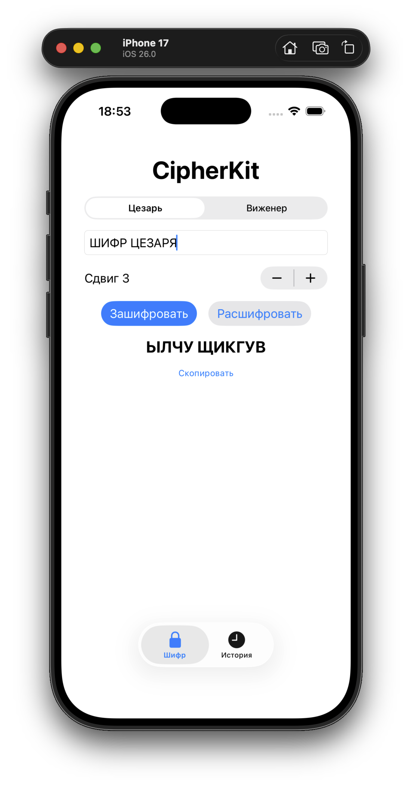
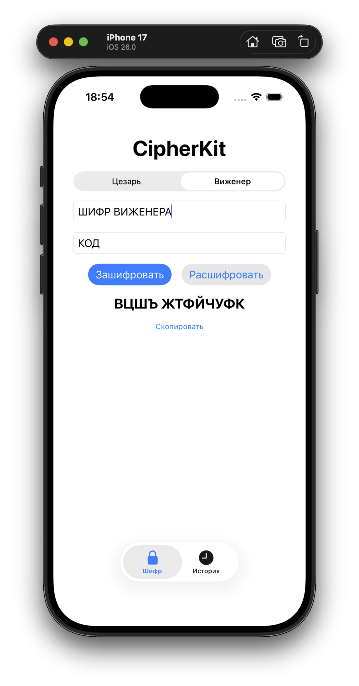
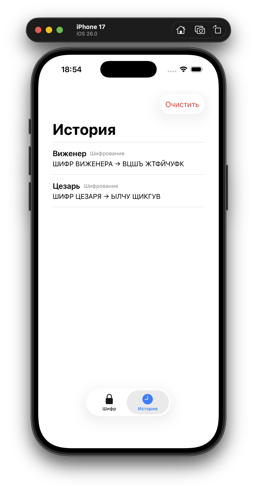
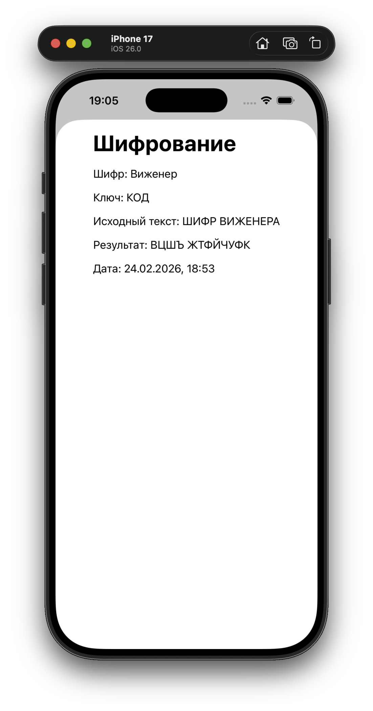

# 🔐 CipherKit

**Универсальное iOS-приложение для шифрования и дешифрования текста классическими алгоритмами**

CipherKit — учебный проект, реализующий два классических криптографических алгоритма: **шифр Цезаря** и **шифр Виженера**. Приложение построено на архитектуре **MVVM** с использованием **SwiftUI** и демонстрирует принципы объектно-ориентированного проектирования через паттерн «Стратегия».

---

## Скриншоты

| Шифр Цезаря | Шифр Виженера | История операций | Подробная информация операции |
|:-----------:|:-------------:|:----------------:|:----------------:|
|  |  |  |  |

---

## Возможности

- **Шифр Цезаря** — шифрование и дешифрование с настраиваемым сдвигом (1–31)
- **Шифр Виженера** — шифрование и дешифрование с текстовым ключом
- **Переключение между шифрами** в одно нажатие через Segmented Control
- **История операций** — автоматическое сохранение каждой операции с датой и параметрами
- **Персистентность данных** — история сохраняется между сессиями через UserDefaults
- **Детали операции** — просмотр подробностей каждой записи в модальном окне
- **Управление историей** — удаление отдельных записей свайпом и полная очистка
- **Копирование результата** в буфер обмена
- **Автоматический перевод** вводимого текста в верхний регистр

---

## Архитектура

Проект построен на паттерне **MVVM (Model-View-ViewModel)**:

```
CipherKit/
├── Model/
│   ├── Cipher.swift          # Протокол Cipher, CaesarCipher, VigenereCipher
│   └── HistoryItem.swift     # Модель записи истории
├── ViewModel/
│   └── CipherViewModel.swift # Бизнес-логика, управление состоянием
├── View/
│   ├── ContentView.swift     # TabView с навигацией
│   ├── CipherView.swift      # Главный экран шифрования
│   ├── HistoryView.swift     # Список истории операций
│   └── HistoryDetailView.swift # Детали записи (Sheet)
└── CipherKitApp.swift        # Точка входа
```

### Ключевые решения

- **Протокол `Cipher`** — единый интерфейс для всех алгоритмов шифрования (`encrypt` / `decrypt`), что позволяет легко добавлять новые шифры
- **Паттерн «Стратегия»** — выбор алгоритма шифрования в runtime без изменения клиентского кода
- **ObservableObject + @Published** — реактивное обновление интерфейса при изменении данных
- **Codable** — сериализация истории для хранения в UserDefaults

---

## Алгоритмы

### Шифр Цезаря

Каждая буква текста сдвигается на фиксированное количество позиций в алфавите:

```
Шифрование:  Eᵢ = (Pᵢ + shift) mod 32
Дешифрование: Dᵢ = (Cᵢ + 32 - shift) mod 32
```

### Шифр Виженера

Полиалфавитный шифр — сдвиг для каждой буквы определяется соответствующей буквой ключевого слова:

```
Шифрование:  Eᵢ = (Pᵢ + Kᵢ) mod 32
Дешифрование: Dᵢ = (Cᵢ + 32 - Kᵢ) mod 32
```

где `Kᵢ` — индекс буквы ключа, циклически повторяющегося до длины текста.

---

## Технологический стек

| Технология | Назначение |
|:--|:--|
| **Swift** | Язык программирования |
| **SwiftUI** | Декларативный UI-фреймворк |
| **Combine** | Реактивное связывание данных |
| **UserDefaults** | Локальное хранение истории |
| **Xcode** | Среда разработки |

---

## Запуск

1. Клонируйте репозиторий:
```bash
git clone https://github.com/iFlyZed/CipherKit.git
```

2. Откройте `CipherKit.xcodeproj` в Xcode

3. Выберите симулятор или устройство

4. Нажмите **Run** (⌘R)

**Требования:** Xcode 26, iOS 26

---

## Возможные улучшения

- Добавление новых шифров (Атбаш, ROT13, шифр Плейфера)
- Частотный анализ для криптоанализа зашифрованного текста
- Поддержка латинского алфавита
- Экспорт истории операций
- Визуализация процесса шифрования с анимацией

---

## 📄 Лицензия

MIT License
